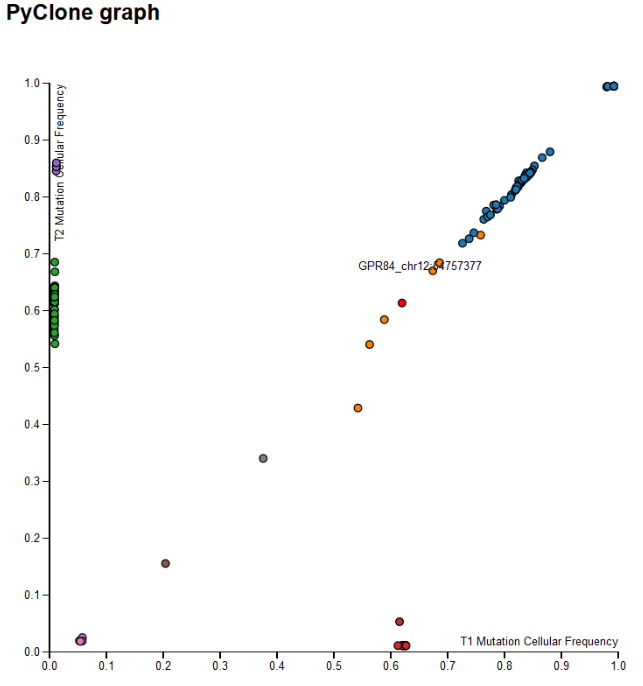

Pyclone 
==========

A d3-made scattered plot that reads in a .tsv file. So to view it, it has to be on Firefox or a security-disabled chrome browser. 

The scattered plot basically displays the output of a software called [Pyclone](http://compbio.bccrc.ca/software/pyclone/). Click on the link to read more about it. In shorts, the software looks at mutations and cellular prevalencies together to decide which mutations belong to the same clonal populations of cancer cells. 

Either axis in the graph represents a tumour sample, and both tumours are from the same person. Each dot is a mutation (more information shows when hovered-over). 

So by summarizing the information in this scattered plot, we can see which mutations are prevalent in one particular tumour sample and thus what distinguish those two tumours from each other and what might have led to the distinction (more frequently occurred mutations might have arisen earlier). We can also see what mutations are frequently occuring in both (they might be common driver oncogenes, for examples). Summarizing those information in a scattered plot and allowing information to appear as user hover over the dots are efficient ways of visualizing the data. 

Right now the output of pyclone hasn't been standardized, so this visualization module is not hooked onto query to Shah lab's cancer genomic database and is simply reading from a tsv file. That's an easy fix though, once in the future we have this data generated by running pyclone through the sequence information in the repository. 
